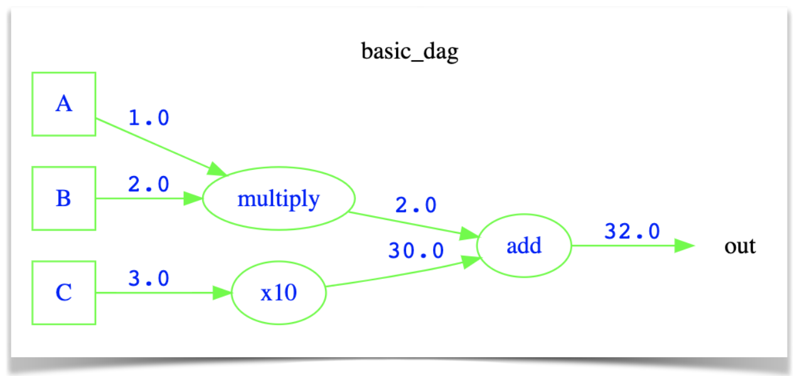

# Demo

It is planned to provide a demonstation site where example DAGs can be seen and updated.

The following screen shots, and video, have been taken from a prototype site.

=== "Basic DAG"
    
=== "Long calculation"
    
=== "Duplicate nodes"
    

The video shows a dev site beeing used, where;

* Single then multiple updates are made to a basic DAG using the GUI.
* Then the back end is used to show updates to multipe DAGs and multiple nodes.

