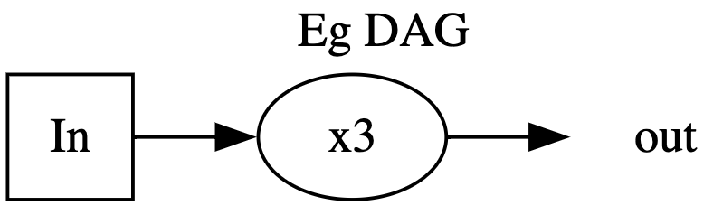
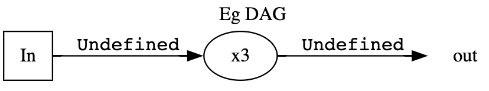
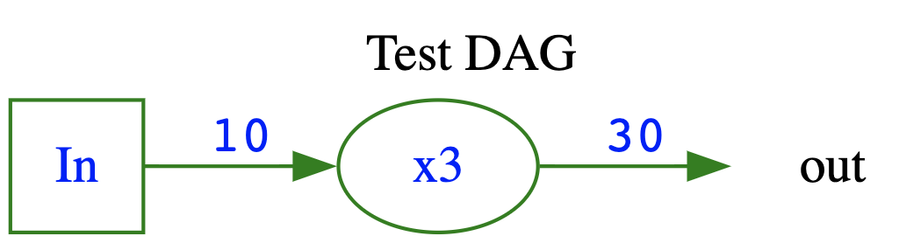

In the pydagoras github repository folder `tests` includes the script `eg_use_pydagoras.py`

The following code will create the simple DAG
<br>
<br>
{: style="height:100px;width:350px"}


``` python title="Import the necessary code from pydagoras" linenums="4" 
from pydagoras.dag_dot import DAG_dot, calc
```
``` python title="Define the node calculations" linenums="9" 
    @calc
    def tripple(node=None):
        return node.get_value() * 3
```
``` python title="Create the DAG" linenums="14" 
    dag = DAG_dot(label='Eg DAG')
```
``` python title="Define the input node and single calculation node" linenums="15" 
    n2 = dag.makeNode('x3', calc=tripple, tooltip='multiply')
    n1 = dag.makeNode('In', calc=None, usedby=[n2], nodetype='in')
```
``` python title="Print the initial DAG" linenums="36"
    print(dag.G.to_string())  
```
``` python title="Update the DAG input" linenums="19" 
    dag.set_input('In', 10)
```
``` python title="Print the final DAG" linenums="36"
    print(dag.G.to_string()) 
```
<br>
Putting it all together...

``` python title="eg_use_pydagoras.py" linenums="1"
# eg_use_pydagoras.py
# a script to provide an example of creating and using a DAG using pydagoras

from pydagoras.dag_dot import DAG_dot, calc

def run():

    print('#######################################')

    @calc
    def tripple(node=None):
        return node.get_value() * 3

    dag = DAG_dot(label='Eg DAG')
    n2 = dag.makeNode('x3', calc=tripple, tooltip='multiply')
    n1 = dag.makeNode('In', calc=None, usedby=[n2], nodetype='in')

    print('Initial DAG')
    print(dag.G.to_string()) # (1)

    print('Updates --------------')
    dag.set_input('In', 10)

    print('Outputs --------------')
    dag.ppInputs() # (2)
    dag.ppOutput() # (3)
    dag.pp() 

    print('Final DAG')
    print(dag.G.to_string()) # (4)

if __name__ == '__main__':
    run()
    print('Done.')

```

1.  <pre>strict digraph  {
	graph [label="Eg DAG",
		labelloc=t,
		rankdir=LR
	];
	out	 [color=white];
	x3	 [tooltip=multiply];
	x3 -> out	 [fontname=Courier,
		label=Undefined];
	In	 [shape=square];
	In -> x3	 [fontname=Courier,
		label=Undefined];
}</pre>

2.  <pre>DAG: Eg DAG
Inputs:
NODE: in, id:In, value:10
      display_name:In tooltip:
      calc: None usedby:x3</pre>
3.  comment y I'm a code annotation! I can contain `code`, __formatted
4.  <pre>strict digraph  {
	graph [label="Eg DAG",
		labelloc=t,
		rankdir=LR
	];
	out	 [color=white];
	x3	 [color=green,
		fontcolor=blue,
		tooltip=multiply];
	x3 -> out	 [color=green,
		fontcolor=blue,
		fontname=Courier,
		label=30];
	In	 [color=green,
		fontcolor=blue,
		shape=square];
	In -> x3	 [color=green,
		fontcolor=blue,
		fontname=Courier,
		label=10];
}</pre>



------------------------


